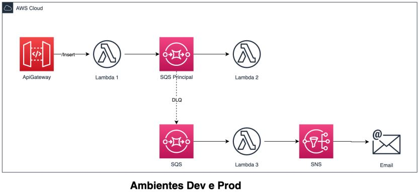

<h1 align="center"> 
  <br>FIAP:  MBA Engenharia de Software - 75AOJ
  <br>
</h1>

<h4 align="center">Cloud Computing & SRE</h4>
Repositório: https://github.com/rafaelxbs/Cloud-Trabalho-Final

## Arquitetura solicitada


## Como configurar o ambiente

1. Clone o repositório para o ambiente já configurado.
2. Utilize o comando ```cd  ~/environment/Trabalho-Final/S3``` para entrar na pasta do S3.
3. Utilize o comando ```terraform init```.
4. Em seguida, utilize o comando ```terraform plan```.
5. Em seguida, utilize o comando ```terraform apply -auto-approve```.
6. Utilize o comando ```cd  ~/environment/Trabalho-Final/Terraform```.
7. Utilize o comando ```terraform workspace select (dev ou prod)```. Note que o ambiente escolhido aqui deverá ser utilizado também como stage no deploy do serverless.
8. Utilize novamente, em sequência, as instruções de 3 a 5.
9. Anote os outputs, eles deverão ser substituídos no arquvio serverless.yml.
10. Adeque as URLs e ARNs no arquivo serverless.yml, de acordo com os outputs anotados no passo 9.
11. Utilize o comando ```cd  ~/environment/Trabalho-Final/Serverless```.
12. Utilize o comando ```pip3 install -r requirements.txt -t layer```. O conteúdo da pasta precisou ser removido para não exceder o limite de armazenamento do trabalho no portal da FIAP.
13. Com o ambiente escolhido no passo 7, utilize o comando ```sls deploy --stage (dev ou prod)```.
14. Anote a url gerada para a API Gateway.
15. Faça uma assinatura para o SNS gerado no item 8, direcionando para o seu e-mail.
16. Você receberá um e-mail para aceitar a inscrição, aceite.
17. Crie uma chamada POST para o endereço anotado no item 13. Nesse passo, é interessante fazer repetidas chamadas, visto que a geração ou não de erro é aleatória.
18. Observe os logs do CloudWatch.
19. Para remover os itens criados:
  19.1 Utilize o comando ```sls remove --stage (dev ou prod)```
  19.2 Utilize o comando ```cd  ~/environment/Trabalho-Final/Terraform```.
  19.3 Utilize o comando ```terraform workspace select (dev ou prod)```. Em seguida, ```terraform destroy -auto-approve```.

## Créditos

> Anelyn [@anelynOvalle](https://github.com/anelynOvalle) &nbsp;&middot;&nbsp;
> Fábio Alencar [@fabioalencar](https://github.com/fabioalencar) &nbsp;&middot;&nbsp;
> Juliana Medeiros [@jujmor](https://github.com/jujmor) &nbsp;&middot;&nbsp;
> Rafael Barbosa [@rafaelxbs](https://github.com/rafaelxbs)
